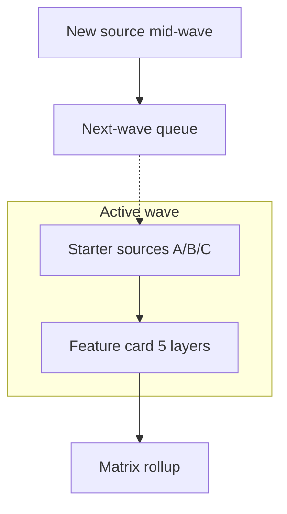
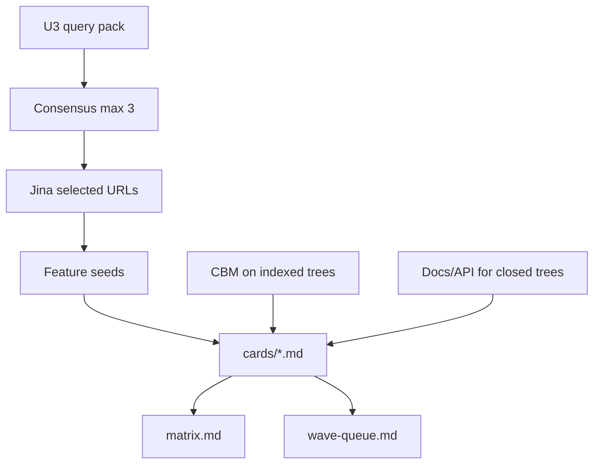

# Applicability Matrix Research - Plan

## Goal Capsule

- **Objective:** Produce a living, orthogonal applicability matrix for Kutha by completing **feature cards** (source of truth) that roll up to the matrix view — so ADR work can judge ideas without inventing product behavior from vendor marketing.
- **Product authority:** `STRATEGY.md` (STCA first, feature-then-niche, legal wedge is GTM not a research filter). ADR-000 D1–D10 stay locked; this work does not reopen them.
- **Open blockers:** None.
- **Product Contract preservation:** unchanged (R/F/AE/KD IDs stable). Planning resolved storage, Wave-1 inventory, and Consensus batching as KTDs.

---

## Product Contract

### Summary

Ship a research product whose unit of work is a **feature card** with five layers (or an explicit “no niche”).
The **matrix** is a derived index: Kutha axis × feature × usefulness / optimality / demand, plus niche→effect.
Wave 1 finishes the starter corpus to full cards; newly discovered sources wait for the next wave.

### Problem Frame

ADR authors currently pull ideas from STRATEGY, honeycomb notes, vendor audits, and chat.
That mix cherry-picks, conflates stubs with implementations, and starts from GTM (legal/science) instead of from capabilities.
Closed-source systems (RavenDB) and Consensus rate limits make a “read all the code, then Google papers” path fail silently.
Without a bounded card→matrix contract, either the corpus never ends or cells stay half-filled.

### Key Decisions

- KD1. **Card is source of truth; matrix is rollup.** (session-settled: user-directed — chosen over matrix-as-SoT and axis-first filling: matches per-feature investigation and a complete cell). Governs R1, R2, F1
- KD2. **Five layers required, or explicit “no niche”.** (session-settled: user-directed — chosen over stop-at-demand and sparse program-coverage: a cell is not closed with empty layer 5). Governs R3, AE3
- KD3. **Scores are high/med/low plus evidence confidence.** (session-settled: user-directed — chosen over 1–5 rubrics and prose-only apply/don’t). Governs R4
- KD4. **Corpus is open; bounded by waves.** (session-settled: user-directed — chosen over a closed vendor list and an ungated living dump: Wave 1 = starter set to five layers; newcomers wait). Governs R5, R6, F2
- KD5. **Feature first, niches last.** (session-settled: user-approved — chosen over GTM-first filtering of the corpus). Governs R3, R11
- KD6. **Consensus is a prepared intake; Jina reads papers; no Consensus per feature.** (session-settled: user-directed — chosen over ad-hoc aggregator search on every cell). Governs R7, F3, AE4
- KD7. **Idea collection does not drop stubs.** (session-settled: user-directed — chosen over REAL-only pack adaptation as the research filter). Governs R8
- KD8. **Missing code uses weaker evidence modes, not omission.** (session-settled: user-directed — chosen over skipping RavenDB-class sources). Governs R9, AE1
- KD9. **A broken channel degrades; it does not halt the program.** (session-settled: user-directed — chosen over all-or-nothing pipeline). Governs R10, AE4

### How This Work Fits Together

<!-- ce-section: work-relationships -->

This plan owns **the research artifact contract** (cards, matrix rollup, waves, evidence rules).
The broader Kutha stack below is current understanding, not a roadmap this contract must deliver.

- Kutha engine / P0 runtime spike — `Can proceed independently of` this research; `Shares` D1–D10 locks
- Honeycomb ADRs (010+) — `Depends on` surviving cards when a cell graduates to an ADR; not in this plan’s Requirements
- `ce-plan` of this artifact — `Depends on` this Product Contract (how to run scouts, store cards)
- Vendor pack implementation — `Deferred`; `Outside` this plan (`Shares` ideas via cards only)
- STRATEGY GTM wedge (legal first) — `Shares` niche layer language; `Does not` filter Wave-1 intake

### Requirements

**Artifact shape**

- R1. Each investigated capability exists as one feature card that a reader can use without opening the matrix.
- R2. The matrix is generated or maintained as a rollup of cards; it must not contain a feature that has no card.
- R3. Every closed card includes layers: (1) raw idea exists, (2) STCA applicability, (3) quality/cost, (4) demand, (5) niche→effect **or** the explicit mark `no niche`.
- R4. Usefulness, optimality, and demand on a closed card each use `{high|med|low}` plus one confidence tag `{code|spec|observed|claim|paper}`.
- R11. Layer 5 must not be used to admit or reject a feature at layers 1–4.

**Waves and corpus**

- R5. Wave 1 evaluates a starter set through R3–R4 before any newly discovered source is promoted into that wave.
- R6. A source found mid-wave is queued for the next wave; it must not open incomplete cards inside the active wave.

**Evidence channels**

- R7. Literature intake is a prepared Consensus query pack, then Jina on the selected paper URLs; per-feature follow-up must not call Consensus.
- R8. Vendor stubs, marketing facades, and disconnected APIs still become cards, tagged `claim` or `intent`, not deleted at intake.
- R9. When kernel source is unavailable, the card still exists using `spec`, `observed`, or `claim` (RavenDB-class); confidence must not be recorded as `code`.
- R10. If Consensus, Jina, or a code index fails, remaining channels continue; the card records the failed channel rather than treating the feature as absent.

**Orthogonality**

- R12. Cards map onto Kutha/STCA axes (Space, Time, Composition, Data, Agent, Verify, Query, Security, Packaging/Vertical as needed). One feature may occupy several axes as several mappings, not one vendor-shaped row that copies their product menu.



### Key Flows

- F1. Close a feature
  - **Trigger:** A scout names a capability.
  - **Actors:** Research runner, card store, matrix rollup
  - **Steps:** Write/update the card through layers 1–4; complete layer 5 or `no niche`; scores+confidence per R4; rollup refresh.
  - **Outcome:** Card is closed; matrix row/cells exist only from that card.
  - **Covered by:** R1, R2, R3, R4, R11

- F2. Bound an open corpus
  - **Trigger:** Investigation finds a vendor or paper family not in the active wave.
  - **Steps:** Queue it; do not start a Wave-1 card for it; continue the starter set to R3.
  - **Outcome:** Active wave stays finite.
  - **Covered by:** R5, R6

- F3. Literature intake
  - **Trigger:** Prepared query pack is ready.
  - **Steps:** Consensus once for hits and citation links; dedupe; Jina on chosen URLs; features enter cards; further digging uses code index, specs, Jina, local ADRs — not Consensus.
  - **Covered by:** R7, R10

### Acceptance Examples

- AE1. RavenDB in-DB agents
  - **Covers:** R9, R8
  - **Given:** No kernel tree in vendor-source
  - **When:** The capability is assessed
  - **Then:** A card exists with confidence `spec` or `claim`, never `code`; it is not omitted

- AE2. RuVector Cypher executor empty-success
  - **Covers:** R8, R4
  - **Given:** Public API returns empty success
  - **When:** Intake runs
  - **Then:** A card exists as idea/`claim`; REAL-only pack rules do not drop it

- AE3. Useful engine idea with no GTM wedge
  - **Covers:** R3, R11
  - **Given:** Layers 1–4 are filled and demand is med/high
  - **When:** No regulated niche is credible
  - **Then:** Layer 5 is `no niche`; the card may still close

- AE4. Consensus rate-limit mid-intake
  - **Covers:** R7, R10
  - **Given:** Hit-list already returned
  - **When:** Further Consensus calls fail
  - **Then:** Jina proceeds on known URLs; new aggregator queries stop; A/B code/spec work continues; cards note `consensus_failed`

- AE5. Helix found while Wave 1 is open
  - **Covers:** R5, R6
  - **Given:** Helix was not in the declared Wave-1 set (or was already in it — then it is not “new”)
  - **When:** A paper link surfaces an extra system
  - **Then:** If not in Wave 1, it is queued; Wave-1 cards are not left incomplete to chase it

### Success Criteria

- A cold ADR author can pick a closed card and see applicability, scores, confidence, and niche/`no niche` without rereading chat.
- Wave 1 can be declared done when every Wave-1 source has either closed cards for extracted features or an explicit “no extractable feature” note — not when “all of vendor-source” is exhausted.
- `ce-plan` can sequence scouts and storage without inventing cell-complete rules.

### Scope Boundaries

**Deferred for later**

- How cards are stored (files, HTML, honeycomb ADR bodies)
- Subagent roster and prompts
- Exact Consensus query text
- Graduating a card into a numbered honeycomb ADR
- Pack/vendor implementation

**Outside this product's identity**

- Rewriting ADR-000 D1–D10 or replacing event-log SoT
- GTM-first corpus filter (legal/science as intake gate)
- REAL-only RuVector adaptation as the idea filter (that note remains a later implementation stance)
- Treating the matrix as a shipping roadmap or copy-from-vendor backlog
- Per-feature Consensus usage

### Dependencies / Assumptions

- Wave-1 starter set is the conversation list unless planning revises it: RuVector + AgentDB, Samyama, Helix, Falkor, Raven, Tarantool, RocksDB, plus the Consensus→Jina paper layer.
- Code analysis, when a tree exists, uses codebase-memory-mcp; absence of an index uses R9, not a halt.
- `STRATEGY.md` and ADR honeycomb axes are the orthogonality frame.
- Adjacent note `ruvector-plugin-adaptation.md` is **not** this contract; it must not override R8.

### Outstanding Questions

**Deferred (non-blocking)**

- Exact wording of the three Consensus queries (U3 drafts them at execution; intent is locked in KTD4)
- Whether Helix/Falkor/Tarantool trees appear later on disk (U2 re-checks; still Wave 1 via R9 until then)

### Sources / Research

- `STRATEGY.md` — STCA tracks; metrics provisional; GTM wedge
- `docs/ADR/README.md` — honeycomb axes
- `docs/ADR/ADR-000-kutha-hybrid-architecture-research.md` — vendor inputs including HelixDB, RavenDB, Tarantool, RocksDB, ruVector/RVF
- `.compound-engineering/artifacts/research/ruvector-plugin-adaptation.md` — pack-adaptation (contrast with R8)
- `.compound-engineering/artifacts/research/patterns.md` — feature-candidate table mapped to STCA
- Session framing: Consensus→Jina, closed-source evidence modes, channel degradation

---

## Planning Contract

### Key Technical Decisions

- KTD1. **Store the program under** `.compound-engineering/artifacts/research/applicability/` **(markdown cards + rollup).** Instantiates KD1 / R1–R2. Not honeycomb ADR files and not a spreadsheet SoT.
- KTD2. **Card file = YAML frontmatter (rollup fields) + five layer headings.** Instantiates R3–R4. Matrix is rebuilt by reading frontmatter (manual table refresh in Wave 1 is acceptable if generation is not yet scripted).
- KTD3. **Wave-1 named set stays the brainstorm list.** Instantiates R5. Inventory (this session): code trees exist for RuVector, Samyama, RocksDB; AgentDB is `vendor-source/ruflo/plugins/ruflo-agentdb` plus RuVector `AGENTDB-EXPLORATION.md`; Helix, Falkor, Tarantool, Raven have **no** kernel tree in `vendor-source` → U5 / R9 from the start.
- KTD4. **Consensus: one intake, at most three `search` calls (tool batch cap), then stop.** Instantiates R7, AE4. Queries cover (a) bi-temporal / event-sourced graphs, (b) worst-case optimal / graph join + materialization, (c) in-DB or verified agents — not vendor brand names as the only term.
- KTD5. **codebase-memory-mcp: `list_projects` then search; index only if the tree is missing from the index.** Instantiates R10. Do not reindex RuVector (~531k nodes) unless status is empty/corrupt.
- KTD6. **One scout subagent per Wave-1 source (or per missing-tree cluster), each writes cards into `cards/` and a source dossier.** Instantiates F1. New vendors discovered mid-scout go to `wave-queue.md` (R6), not into that scout’s incomplete cards.
- KTD7. **Do not treat** `.compound-engineering/artifacts/research/ruvector-plugin-adaptation.md` **as a drop-filter.** Instantiates R8 / KD7.

### High-Level Technical Design

Directional only — not an implementation spec.



Card frontmatter (directional field set):

```yaml
id: slug
source: ruvector|agentdb|samyama|helix|falkor|raven|tarantool|rocksdb|paper|cozo|graphiti|pogocache|dify|law-nexus|daily-archive|reactivegraph|hindsight|oxixml|oxify|scirs|ultra|crp-spmm|typegraph|open-ontologies|engramx|harvey
axes: [Time, Data]
usefulness: high|med|low
optimality: high|med|low
demand: high|med|low
confidence: code|spec|observed|claim|paper
layer5: niche-text|no niche
status: open|closed
channels_failed: []
```

### Assumptions

- External trees live outside this repo (`vendor-source/`, `/root/samyama-graph`); this plan only writes kutha-graph research artifacts.
- Wave 1 does not require cloning Helix/Falkor/Tarantool to start; if clones appear, U2 upgrades confidence on existing cards rather than opening a new wave.
- Consensus remaining quota is unknown; U3 aborts aggregator use after the first rate-limit and continues with Jina on whatever URLs were already returned.

### Approach

Scaffold (U1) → inventory (U2) → literature intake (U3, once) → parallel source scouts (U4 code, U5 spec) → Wave-1 close and rollup (U6).
Feature-first: scouts extract capabilities before writing layer 5.
Execution note: knowledge-work; subagents save dossiers; no Kutha engine code in this plan.

### Output Structure

```text
.compound-engineering/artifacts/research/applicability/
  README.md
  card-template.md
  matrix.md
  wave-queue.md
  consensus-query-pack.md
  WAVE1-ACCEPTANCE.md
  sources/          # one dossier per Wave-1 source
  cards/            # one markdown file per feature
```

---

## Implementation Units

### U1. Research scaffold

- **Goal:** Empty-but-valid card template, matrix stub, wave queue, README so later units have a place to write. Covers R1, R2, KTD1, KTD2.
- **Files:** `.compound-engineering/artifacts/research/applicability/README.md`, `card-template.md`, `matrix.md`, `wave-queue.md`
- **Approach:** Copy the five-layer headings and frontmatter keys from KTD2; matrix starts with column headers only (axes × score fields); queue starts empty.
- **Depends on:** none
- **Test scenarios:**
  - Happy: a dummy closed card following the template can be listed in `matrix.md` by `id` without extra fields.
  - Edge: template shows `no niche` as a valid layer-5 value.
  - Error: README states cards are SoT and matrix must not invent rows (R2).

### U2. Wave-1 inventory and channel map

- **Goal:** One table: each Wave-1 name → path or `absent`, CBM project id or `unindexed`, default confidence mode. Covers R5, R9, R10, KTD3, KTD5.
- **Files:** `.compound-engineering/artifacts/research/applicability/sources/inventory.md`
- **Approach:** Confirm disk (known: RuVector, Samyama, RocksDB present; Helix/Falkor/Tarantool/Raven absent; AgentDB = ruflo plugin + exploration doc). Call `list_projects`; record index names. Do not clone missing engines in this unit.
- **Depends on:** U1
- **Test scenarios:**
  - Happy: every Wave-1 name has a row.
  - Edge: Raven row says `absent` and default `spec`/`claim`, not `code`.
  - Error: missing CBM project is `unindexed`, not treated as “source does not exist.”

### U3. Literature intake pack

- **Goal:** Written three-query pack; one Consensus batch; Jina on selected URLs; paper-derived feature seeds as cards or seed list. Covers R7, F3, AE4, KTD4.
- **Files:** `.compound-engineering/artifacts/research/applicability/consensus-query-pack.md`, `sources/papers.md`, `cards/` (paper-sourced slugs)
- **Approach:** Author queries before any Consensus call. Batch ≤3. Persist hit titles, URLs, citation links. Jina-read only the selected set. Map each distinct capability to a card stub (layers 1–2 at least; close through R3 in U6 if scout time remains). On rate-limit: write `consensus_failed`, stop aggregator, continue Jina + U4/U5.
- **Depends on:** U1
- **Test scenarios:**
  - Happy: pack file contains exactly three intended queries before the tool is used.
  - Edge: a paper about Graphiti still becomes a card (idea), not a vendor-SoT recommendation.
  - Error: rate-limit produces `channels_failed` including consensus; U4 still allowed to run.

### U4. Code-indexed source scouts

- **Goal:** Closed or explicitly empty-extract cards from RuVector, AgentDB (plugin/docs), Samyama, RocksDB via CBM. Covers R8, R12, F1, KTD5, KTD6, KTD7, AE2.
- **Files:** `.compound-engineering/artifacts/research/applicability/sources/{ruvector,agentdb,samyama,rocksdb}.md`, `cards/*.md`
- **Approach:** Per source: architecture gist + search for capabilities (HNSW, WAL, COW, agents, Cypher, MVCC, etc.). Stubs become `claim`/`intent` cards. Map axes per R12. Queue non-Wave-1 systems to `wave-queue.md`. Subagent per source; persist dossier even if zero features (`no extractable feature`).
- **Depends on:** U1, U2
- **Test scenarios:**
  - Happy: at least one RuVector card exists with `confidence: code` or `claim` as appropriate.
  - Edge: empty-success Cypher facade is a card, not omitted (AE2).
  - Error: scout failure writes `channels_failed` on the source dossier, not a fake empty corpus.

### U5. Spec/observed scouts (no kernel tree)

- **Goal:** Cards for Helix, Falkor, Raven, Tarantool using docs/API/talks/Jina — never `confidence: code`. Covers R9, AE1, KTD3.
- **Files:** `.compound-engineering/artifacts/research/applicability/sources/{helix,falkor,raven,tarantool}.md`, `cards/*.md`
- **Approach:** Official docs first (Jina). Record URL on every claim. In-DB agents (Raven) is a required probe (AE1). GraphBLAS/sparse (Falkor), indexes-as-access-paths (Helix), compute-near-data (Tarantool) are required probes from ADR-000 citations.
- **Depends on:** U1, U2
- **Test scenarios:**
  - Happy: Raven card exists with `spec` or `claim`.
  - Edge: if a doc URL fails, card remains with `channels_failed` and weaker remaining evidence.
  - Error: no card marked `code` for these four names.

### U6. Wave-1 close and matrix rollup

- **Goal:** Every Wave-1 source has closed cards or a no-extract note; `matrix.md` has only card-backed rows; layer 5 filled or `no niche`. Covers R2, R3, R11, AE3, Success Criteria.
- **Files:** `.compound-engineering/artifacts/research/applicability/matrix.md`, `WAVE1-ACCEPTANCE.md` (checked off)
- **Approach:** Audit cards against R3–R4. Fill layer 5 last. Rebuild matrix from frontmatter. Do not start Wave 2.
- **Depends on:** U3, U4, U5
- **Test scenarios:**
  - Happy: matrix row count equals closed card count.
  - Edge: a high-demand engine idea with `no niche` is still closed (AE3).
  - Error: a matrix row without a `cards/` file fails WAVE1-ACCEPTANCE.

---

## Verification Contract

Primary gate is `.compound-engineering/artifacts/research/applicability/WAVE1-ACCEPTANCE.md` (created in U1, completed in U6).

Checks (must all pass to declare Wave 1 done):

| Check | Passes when |
|-------|-------------|
| Template | U1 files exist; dummy card fits template |
| Inventory | All Wave-1 names listed; absent trees not scored `code` |
| Consensus | Pack has 3 queries; ≤3 search calls documented; degrade path recorded if used |
| Cards | Each closed card has five layers or `no niche`; scores + confidence present |
| Stubs | At least one `claim`/`intent` card if RuVector facades were seen |
| Raven | ≥1 Raven card with non-`code` confidence |
| Rollup | `matrix.md` rows ⊆ card ids |
| Queue | Mid-wave discoveries only in `wave-queue.md` |

No Kutha engine test suite is in scope.

---

## Definition of Done

- U1–U6 complete or explicitly blocked with a recorded channel failure that still leaves remaining sources closed.
- WAVE1-ACCEPTANCE all-pass, or listed waivers with R10 justification.
- Product Contract R1–R12 not contradicted by artifacts.
- No honeycomb ADR opened solely to dump vendor features.
- Wave 2 not started.

---

## Appendix

**Wave-1 disk snapshot (planning time, 2026-08-17):** present — `vendor-source/ruvector`, `vendor-source/samyama-graph`, `/root/samyama-graph`, `vendor-source/rocksdb`, `vendor-source/ruflo/plugins/ruflo-agentdb`. Absent kernels — Helix, FalkorDB, Tarantool, RavenDB. AgentDB narrative — `vendor-source/ruvector/examples/meta-cognition-spiking-neural-network/docs/AGENTDB-EXPLORATION.md`.
