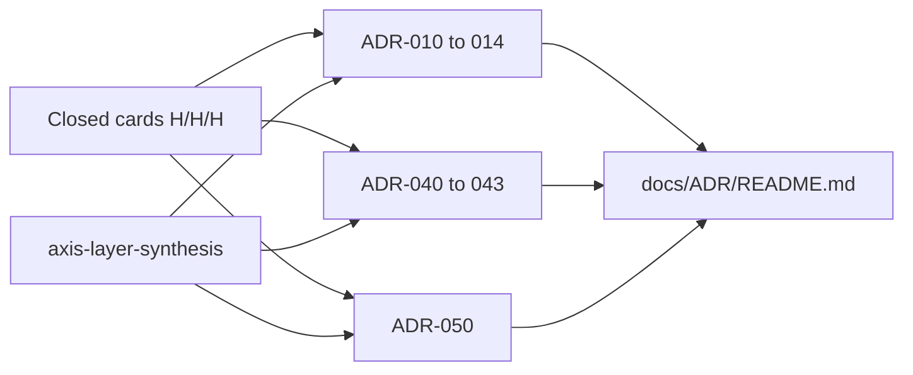

# P0 Honeycomb Graduation - Plan

## Goal Capsule

- **Objective:** Open nine **Research** honeycomb ADRs (Time 010–014, Data 040–043, Agent 050) that convert the applicability matrix’s H/H/H spine — plus D3’s dict-first control plane — into named cells, without implementing the Kutha engine and without minting Consensus Query 103+.
- **Product authority:** `STRATEGY.md` P0–P1 tracks; ADR-000 D1–D10 locked (especially D3); ADR-001/002 unrewritten; card SoT in `.compound-engineering/artifacts/research/applicability/` (`axis-layer-synthesis.md`, `research-boundary.md`, `matrix.md`).
- **Open blockers:** None. Surrounding cells 031 / 051–052 / 060–061 / 080 remain **out of this unit** (next plans).
- **Product Contract preservation:** new IDs (R/F/AE/KD/KTD/U) for this artifact only.

---

## Product Contract

### Summary

The literature matrix (163 cards) is a noun dictionary. P0 Kutha still has empty honeycomb bands. This work **graduates** Time physics, Data physics, and the Agent **control plane** into ADR-010+ Research cells. Each cell cites named cards, states STCA mapping, non-goals, and open research questions. Legal Layer 5 on those cards is GTM color, not a requirement to implement ADR-090 in this unit.

ADR-050 is **design graduation of D3**, not a paper hunt. Synthesis already recorded: there is **no dedicated “agent dictionary” card**. Cousin cards (LLM-as-compiler, intern map, schema SMO, OBDA compile, ontology versioning, topic routing, ontology MCP) are enough to open the cell.

### Problem Frame

ADR authors would otherwise paste vendor menus or reopen D1–D10. The matrix already judged the nouns; the missing artifact is **one cell per planned title** in `docs/ADR/README.md`. Writing Rust now would skip the cell contract. Another Consensus wave would violate `research-boundary.md`. Leaving 050 closed would leave STRATEGY P1 and ADR-000 R4 without a honeycomb home.

### Key Decisions

- KD1. **This unit is Time 010–014 + Data 040–043 + Agent 050.** (session-settled: user chose widen-050 over also opening 080/031/051). Governs R1, R12
- KD2. **Status = Research, not Accepted.** Cells deepen the spine; they do not ship runtime. Governs R2, R8
- KD3. **Cards stay SoT for evidence; ADRs stay SoT for decisions.** An ADR cites card ids; it does not copy five layers verbatim. Governs R3, R4
- KD4. **No engine, no Consensus, no new matrix rows.** Governs R9, R10
- KD5. **Trap-cluster cards are contrasts, not cell physics.** Graphiti / Dify / Hindsight / Harvey-as-SoT / YOTG `claim` / CRDT / Geo-Raft-as-SoT / oxify DAG stay in Alternatives Considered. Governs R7
- KD6. **ADR-011 and ADR-043 may have thinner card support.** They are still opened: 011 is a Kutha encoding cell surrounded by OCPM + intern dictionary + provenance; 043 is the *compiler* over already-closed access paths. Governs R5, R6
- KD7. **Two dictionary nouns never collapse.** (1) intern / term dictionary = Data encoding (ADR-011, card `paper-rdf-term-dictionary`). (2) agent control dictionaries = temporal graph entities that validate proposals (ADR-050, D3). Governs R13, R14, AE6

### How This Work Fits Together

- Applicability matrix research plan (`plans/2026-08-17-2234-research-applicability-matrix-plan.md`) — `Can proceed independently`; this plan `Depends on` its closed cards
- ADR-090 / ADR-093 verticals — `Share` Layer 5 language and `L_AGENT` plane; `Do not` expand in this unit
- Kutha engine / P0 Rust spike — `Deferred`; `Outside` this plan (`Shares` D1–D10)
- Capability security (051), GenAI enrichment (052), security rewrite (080) — `Deferred` next knowledge-work plans; 050 names the fence, does not specify WASM/ABAC kernels

### Requirements

- R1. Produce exactly nine new files: `docs/ADR/ADR-010-event-log-runtime-quantum.md` through `ADR-014-cascade-budgets-quantum-receipts.md`, `ADR-040-materialization-plugin-protocol.md` through `ADR-043-hybrid-query-planner.md`, and `ADR-050-meta-prompt-dictionaries.md`.
- R2. Each ADR uses the honeycomb template in `docs/ADR/README.md` (Status, Date, Context, Decision, Consequences, Alternatives Considered, Open Research Questions, Related Decisions, Honeycomb coordinates).
- R3. Each ADR lists **card ids** (repo-relative paths under `.compound-engineering/artifacts/research/applicability/cards/`) that ground the cell.
- R4. Decisions are numbered `D0xx-n` (e.g. D010-1, D050-1) and must not rewrite ADR-000 D1–D10.
- R5. ADR-011 states lean event schema as a **Kutha encoding choice**, not a new literature noun. Intern map lives here.
- R6. ADR-043 states hybrid planning as **one compiler over leases**, not a new join algorithm. It does not own NL→MATCH; that bind is 050 + 070.
- R7. Alternatives Considered name rejected SoT (Graphiti, Samyama-as-SoT, CRDT merge, blockchain ADS). ADR-050 additionally names Dify / oxify DAG / Hindsight / Harvey / YOTG as rejected *agent* SoT.
- R8. English only in ADR bodies. Chat with the user stays Russian.
- R9. No `src/` Rust, no Cargo crate, no Consensus `search`.
- R10. `docs/ADR/README.md` index moves the nine titles from Planned to Opened.
- R11. Every cell repeats: log = SoT; CSR/HNSW/views/receipts/partitions are droppable leases; LLM compiles or proposes, never writes truth.
- R12. Do not open 020–022, 030–031, 051–052, 060–062, 070–071, 080–081, 091–092 in this unit.
- R13. ADR-050 names the entity set from ADR-000 R4: `MetaPrompt`, `Dictionary`, `DictionaryEntry`, `AgentInstance` — as **logged temporal graph entities**, not prompt files in git.
- R14. ADR-050 Decision states the D3 cycle (`request → load meta-prompt@T → load dictionaries@T → propose → validate(dicts+security) → execute → event log`) and that FSM/statecharts are **derived** from State+Action dictionaries.



### Key Flows

**Happy path:** Executor writes nine Research ADRs from the citation map below, updates the index, stops.

**Partial cell:** If a card is only med-optimality, still cite it under Open Research Questions, not as a fake kernel.

**Scope leak:** A draft that specifies crate names as mandatory runtime, or opens 051/052/080, fails R9/R12. A draft that treats intern IDs as Action/Policy dictionaries fails KD7.

### Acceptance Examples

- AE1. ADR-010 cites `paper-activegraph-log-is-sot` and `paper-yankin-event-sourced-query`; Decision says the log is SoT.
- AE2. ADR-013 cites `paper-toki-contradiction-ops` and `paper-memstrata-stale-fact`; Graphiti is Alternatives, not Decision.
- AE3. ADR-041 cites `samyama-csr-frozen-adjacency` and `samyama-leapfrog-triejoin` with `confidence: code` as evidence class, not as “vendor Samyama is Kutha.”
- AE4. ADR-042 cites `ruvector-hnsw` and states HNSW is an access-method **fence/pack**, not SoT (D5).
- AE5. README Opened table lists all nine new ADRs; Planned table no longer lists those working titles.
- AE6. ADR-050 cites `paper-llm-compiler-not-executor`; Decision says validate is fail-closed and dictionaries own audited vocabulary; Dify/Hindsight are Alternatives; intern map is pointed at ADR-011, not duplicated as the control plane.

### Scope Boundaries

**In**

- Nine Research ADRs + index update
- Citation map from existing cards
- Open research questions per cell (falsifiable spikes named in prose, not scheduled as this plan’s code)
- ADR-050 entity sketch and D3 cycle (design, not Rust structs)

**Out**

- Kutha engine implementation
- Consensus / new cards / matrix rows
- Graduating ADR-090/093
- ADR-051 capability kernel, ADR-052 enrichment pack, ADR-080 path-ABAC rewrite, pack scheduling under V (031)
- Commits unless the user later asks

### Success Criteria

- Nine files exist and parse as the template.
- Index 1:1 with those files.
- No D1–D10 restatement as a new D0xx that contradicts them.
- An implementer of a later P0/P1 spike can point at one ADR per physics concern, including dict-first agents.
- Two dictionary nouns remain named and distinct (KD7).

---

## Planning Contract

### Key Technical Decisions

- KTD1. **File names follow the planned titles** in `docs/ADR/README.md`, kebab-case. 050 file: `docs/ADR/ADR-050-meta-prompt-dictionaries.md`. Instantiates R1.
- KTD2. **Citation map is normative for this plan** (table below). An ADR may cite extra closed cards; it must cite the *required* set. Instantiates R3, AE1–AE6.
- KTD3. **Style follows ADR-090:** honeycomb coordinates, numbered decisions, hard separations, non-goals. Instantiates R2. 050 may reuse ADR-090’s `L_AGENT` language without rewriting 090.
- KTD4. **Order of writing: Time 010→014, then Data 040→043, then Agent 050, then index.** 014 (budgets) may cite 010 quantum; 041 may cite 040 plugin protocol; 050 cites 011 intern fence and 013 VT×TT; 050 does not depend on 040–043. Instantiates sequencing.
- KTD5. **011, 043, and 050 Open Research Questions are allowed to be the longest.** Instantiates KD6, KD7.
- KTD6. **050 dictionary kinds are D3’s six, not a seventh literature noun:** Controlled vocabulary, Action, Relation, State/mode, Policy, Domain ontology/schema. Vertical packs (090/093) supply *facet contents*, not a second control plane. Instantiates R13, R14.

### Citation map (required cards)

| ADR | Required card ids |
|-----|-------------------|
| 010 Event log & runtime quantum | `paper-activegraph-log-is-sot`, `paper-yankin-event-sourced-query`, `paper-tgms-operators`, `rocksdb-wal-recovery` |
| 011 Lean event schema & lineage | `paper-ocpm-multi-object-events`, `paper-rdf-term-dictionary`, `paper-provenance-semirings` |
| 012 Snapshots / tiers / vacuum | `paper-lsm-snapshot-compaction`, `paper-bach-lsm-csr-bridge`, `paper-semi-external-graph`, `paper-event-log-vacuum-legal-hold` |
| 013 Bi-temporal facts & invalidation | `paper-toki-contradiction-ops`, `paper-memstrata-stale-fact`, `paper-tgql-intervals`, `paper-temporal-interval-index` |
| 014 Cascade budgets & quantum receipts | `paper-max-convolution-budgets`, `paper-constant-size-evidence` |
| 040 Materialization plugin protocol | `paper-pg-materialized-views`, `paper-dbsp-ivm`, `paper-graph-pack-plugin-lifecycle` |
| 041 CSR / GraphBLAS hot path | `samyama-csr-frozen-adjacency`, `samyama-leapfrog-triejoin`, `samyama-late-materialization`, `paper-lftj-wcoj`, `falkor-graphblas-sparse-adj` |
| 042 HNSW access-method fence | `ruvector-hnsw`, `ruvector-hnsw-delete-repair`, `paper-navix-filtered-hnsw`, `paper-acorn-predicate-subgraph` |
| 043 Hybrid query planner | `paper-mixed-vector-relational-access`, `paper-compass-cooperative-hybrid`, `paper-graph-cardinality-estimation`, `paper-sieve-index-collection` |
| 050 Meta-prompt & dictionaries | `paper-llm-compiler-not-executor`, `paper-rdf-term-dictionary`, `paper-online-pg-schema-evolution`, `paper-ontology-temporal-versioning`, `paper-obda-ontology-compile`, `paper-topic-modeled-tool-routing`, `open-ontologies-mcp-govern` |

Contrast-only (Alternatives, not required cites): `graphiti-bitemporal-fact-edges`, `paper-crdt-graph-eventual`, `paper-geo-raft-wan`, `paper-blockchain-graph-ads`, `hindsight-four-network-tempr`, `dify-workflow-rag-orchestration`, `oxify-dag-llm-orchestration`, `harvey-lab-firm-knowledge`, `claim-yotg-context-graph-layers`.

Optional supporting cites for 050 (allowed, not required): `paper-pact-argument-provenance`, `paper-proof-carrying-llm-envelope`, `typegraph-typed-sql-kg`, `law-nexus-kb-ontology-catalog`, `paper-mas-isolation-lattice`.

### Assumptions

- A1. `docs/ADR/` remains the honeycomb home (not CE artifacts).
- A2. Date on ADRs is 2026-08-18.
- A3. Russian ADR-000 body stays as-is; new cells are English per AGENTS.md.
- A4. Zero dedicated “agent dictionary” card is **not** a research blocker; KD7 + cousin cards suffice (synthesis item 3).
- A5. 051 capability / 080 ABAC stay named as *depends-on-later*; 050 must not invent a WASM or rewrite kernel.
- A6. Intern dictionary required on both 011 and 050 is intentional: 011 owns the map; 050 cites it only as the fence against collapsing nouns.

### Sequencing

U1 → U2 → U3 → U4 → U5 → U6 → U7 → U8 → U9 → U10 → U11 (index last).

U10 (050) may start after U2 and U4; it must not start before those two. Data units U6–U9 may run in parallel with drafting 050 after U5.

---

## Implementation Units

### U1. ADR-010 Event log & reactive runtime quantum

- **Goal:** Lock log = SoT, emit→cascade→idle as one quantum, WAL recovery as crash cousin. Covers R1, R11, AE1
- **Files:** `docs/ADR/ADR-010-event-log-runtime-quantum.md`
- **Approach:** Decision: append-only event log; fold is deterministic; quantum has a bound (anticipates 014). Yankin mechanisms as query-over-log cost envelopes, not a second SoT.
- **Depends on:** none
- **Test scenarios:**
  - Happy: D010-1 says log is SoT; required cards listed.
  - Edge: Rocks WAL is recovery of storage, not the semantic log.
  - Error: draft that makes Graphiti edges the SoT fails KD5.

### U2. ADR-011 Lean event schema & lineage

- **Goal:** Encoding cell: lean events + OCPM multi-object + interned dictionary + how-provenance. Covers R5, KD7-part-1
- **Files:** `docs/ADR/ADR-011-lean-event-schema-lineage.md`
- **Approach:** Do not invent a new literature noun. State that schema is a Kutha choice; objects vs events (OCPM); identifiers are dictionary IDs; lineage is semiring-shaped, not LLM narrative. Explicitly point agent control dictionaries to ADR-050.
- **Depends on:** U1
- **Test scenarios:**
  - Happy: Open Research Questions name “canonical event record fields” as a spike, not a crate.
  - Error: treating RDF dictionary as a second SoT fails R11.
  - Error: Action/Policy dictionaries specified here instead of 050 fails KD7.

### U3. ADR-012 Snapshots, segments, tiered storage, vacuum

- **Goal:** Placement of pictures vs policy GC of the log. Covers citation map 012
- **Files:** `docs/ADR/ADR-012-snapshots-tiers-vacuum.md`
- **Approach:** Separate (a) LSM/BACH snapshot *placement*, (b) SEM hot/cold, (c) vacuum + legal hold as *policy on SoT*. Vacuum ≠ compaction.
- **Depends on:** U1
- **Test scenarios:**
  - Happy: three-way distinction in Decision.
  - Error: “compaction deletes history silently” contradicts vacuum card.

### U4. ADR-013 Bi-temporal facts & invalidation

- **Goal:** Native Graphiti *semantics* without Graphiti runtime. Covers AE2, D4
- **Files:** `docs/ADR/ADR-013-bitemporal-facts-invalidation.md`
- **Approach:** VT×TT; TOKI contradiction ops; MemStrata supersession; interval index as access path; T-GQL as language cousin not core. Dictionary entries and meta-prompt versions use the same VT×TT (050 consumes this).
- **Depends on:** U1, U2
- **Test scenarios:**
  - Happy: Graphiti in Alternatives Considered.
  - Edge: cosine/RAG cannot own stale-fact (MemStrata).

### U5. ADR-014 Cascade budgets & quantum receipts

- **Goal:** Cui max-convolution of cascade/agent/materializer budgets + constant-size evidence per quantum. Covers D2/D9 testing
- **Files:** `docs/ADR/ADR-014-cascade-budgets-quantum-receipts.md`
- **Approach:** Receipt is per emit→idle, not blockchain SoT. Budgets compose by max-convolution, not a workflow engine. Receipt may bind `meta_prompt_version` / dictionary snapshot ids (anticipates 050); it does not define the entity schema.
- **Depends on:** U1
- **Test scenarios:**
  - Happy: blockchain ADS named as anchor not SoT.
  - Error: hard FSM as budget allocator contradicts D3.

### U6. ADR-040 Materialization plugin protocol

- **Goal:** Reversible views (PG views / DBSP IVM / pack lifecycle). Covers D5
- **Files:** `docs/ADR/ADR-040-materialization-plugin-protocol.md`
- **Approach:** Plugins register leases of the fold; droppable; pack install ≠ view contract.
- **Depends on:** U1, U5
- **Test scenarios:**
  - Happy: CSR/HNSW listed as *instances* of the protocol, detailed in 041/042.
  - Error: mandatory external Graphiti/Neo4j materializer.

### U7. ADR-041 CSR / GraphBLAS / LFTJ hot path

- **Goal:** Hot picture of adjacency + WCOJ. Covers AE3, STRATEGY track 2
- **Files:** `docs/ADR/ADR-041-csr-graphblas-hot-path.md`
- **Approach:** Samyama/Falkor as *evidence of kernels*, Kutha-owned CSR; LFTJ as theoretical bound; late materialization.
- **Depends on:** U6
- **Test scenarios:**
  - Happy: “Samyama is not Kutha SoT” in Consequences.
  - Error: TypeScript as graph core (D6).

### U8. ADR-042 HNSW access-method fence

- **Goal:** HNSW as pack behind a fence; delete-repair is neighbor rewiring. Covers AE4
- **Files:** `docs/ADR/ADR-042-hnsw-access-method-fence.md`
- **Approach:** NaviX/ACORN as filtered/predicate access; RuVector HNSW `code` evidence; GNN facade stays out (low/low).
- **Depends on:** U6
- **Test scenarios:**
  - Happy: HNSW never owns temporal truth.
  - Error: empty Cypher success as a capability (trap card).

### U9. ADR-043 Hybrid query planner

- **Goal:** One compiler that chooses among leases (scan vs HNSW vs LFTJ vs interval index) using CardEst/SIEVE/Compass. Covers R6, KD6
- **Files:** `docs/ADR/ADR-043-hybrid-query-planner.md`
- **Approach:** Name the gap: many access-path cards, no Kutha cost model. Decision: planner is a pack over 040–042 + 013 indexes; LLM is not the planner. NL→plan bind is 050 (vocabulary) + 070 (surface), not a new WCOJ. Open Research Questions: JOB-class cost envelope, fail-closed exact MATCH.
- **Depends on:** U6, U7, U8, U4
- **Test scenarios:**
  - Happy: no new WCOJ algorithm invented.
  - Error: ULTRA/GNN as MATCH substitute.
  - Error: LLM named as the cost-based planner.

### U10. ADR-050 Meta-prompt & dictionaries

- **Goal:** Design cell for D3: versioned meta-prompt + six dictionary kinds as temporal graph entities; LLM proposes; dictionaries validate fail-closed. Covers R13, R14, AE6, STRATEGY P1, ADR-000 R4
- **Files:** `docs/ADR/ADR-050-meta-prompt-dictionaries.md`
- **Approach:**
  - Restate D3; do not weaken it. Hard FSM remains rejected as *sole* control; derived FSM from State+Action is allowed for audit.
  - Entity sketch (design, not Rust): `MetaPrompt` (versioned constitution: modes, tool policy, temporal semantics, conflict handling), `Dictionary` (kind ∈ D3 six), `DictionaryEntry` (interned id + VT×TT + payload), `AgentInstance` (bound to meta-prompt@version + dictionary snapshot set).
  - Cycle is the Decision, not a workflow engine: load@T → propose → validate(dicts+security) → execute → log. Validate is fail-closed; LLM never writes truth.
  - Fence vs 011: intern map is how strings become ids on the hot path; control dictionaries are *which tokens/actions/relations/policies are legal @T*.
  - Fence vs 043: 043 chooses among *leases*; 050 constrains *which operators and vocab a proposal may use*.
  - Fence vs 051/080: capabilities and ABAC rewrite are named as later cells; 050 may require “validate(+security)” without specifying WASM or path-ABAC.
  - Schema/ontology cousins: `SchemaModify` / τOWL / KGCL / OBDA compile are how Domain ontology/schema dictionaries evolve and compile — not a second SoT.
  - Tool routing: topic/intent table over dictionaries, not Dify Agent node and not always-hit embedding NN.
  - Ontology MCP: generate → validate/certify → log dict events; Oxigraph is working memory.
  - Receipts (014): bind meta-prompt version + dictionary snapshot ids into quantum evidence; 050 does not invent a new receipt algebra.
  - Verticals: legal/science packs supply facet *contents* (ADR-090 `L_AGENT`, ADR-093); 050 owns the *mechanism*.
- **Depends on:** U1, U2, U4
- **Test scenarios:**
  - Happy: D050-1 lists the six dictionary kinds; D050-2 is the D3 cycle; D050-3 is intern≠control (points at 011).
  - Happy: required seven card ids appear; Dify, Hindsight, Graphiti, Harvey, YOTG in Alternatives.
  - Edge: Open Research Questions name (a) canonical fields for `DictionaryEntry`, (b) how meta-prompt@version appears on 014 receipts, (c) derived-FSM snapshot for audit — all as spikes, not crates.
  - Error: “prompt.md in the repo is the constitution” as SoT.
  - Error: hard-coded FSM per vertical as the control plane.
  - Error: Hindsight four-network or Graphiti edges as agent memory SoT.
  - Error: inventing a seventh dictionary kind as a new literature noun, or opening 051/080 files.

### U11. Index rollup

- **Goal:** `docs/ADR/README.md` Opened vs Planned. Covers R10, AE5
- **Files:** `docs/ADR/README.md`
- **Approach:** Move the nine working titles to Opened with links; leave 020–039 remainder, 051–052, 060+, 070+, 080+ in Planned.
- **Depends on:** U1–U10
- **Test scenarios:**
  - Happy: nine new rows; no duplicate titles in Planned.
  - Error: silent rewrite of ADR-000/001/002 rows.
  - Error: 051 or 080 accidentally moved to Opened.

---

## Verification Contract

No Kutha engine test suite. Knowledge-work gates:

| Check | Passes when |
|-------|-------------|
| Files | Nine ADR paths exist; each has Status Research and Date 2026-08-18 |
| Template | Headings from `docs/ADR/README.md` present |
| Cites | Required card ids from the citation map appear as markdown links or backtick ids |
| Locks | No decision revives Graphiti/Samyama/blockchain/CRDT/Dify/Hindsight as SoT |
| Dict split | ADR-011 owns intern map; ADR-050 owns control dictionaries and cites intern only as fence |
| Index | Opened table includes 010–014, 040–043, and 050; Planned no longer lists those nine titles |
| Language | ADR bodies English |
| Scope | No `src/` Rust; no Consensus; no ADR-051/052/080 files |

Spot-check command (executor):

```bash
python3 - <<'PY'
from pathlib import Path
root = Path("docs/ADR")
need = [
  "ADR-010-event-log-runtime-quantum.md",
  "ADR-011-lean-event-schema-lineage.md",
  "ADR-012-snapshots-tiers-vacuum.md",
  "ADR-013-bitemporal-facts-invalidation.md",
  "ADR-014-cascade-budgets-quantum-receipts.md",
  "ADR-040-materialization-plugin-protocol.md",
  "ADR-041-csr-graphblas-hot-path.md",
  "ADR-042-hnsw-access-method-fence.md",
  "ADR-043-hybrid-query-planner.md",
  "ADR-050-meta-prompt-dictionaries.md",
]
missing = [n for n in need if not (root/n).exists()]
print("missing", missing)
idx = (root/"README.md").read_text()
for n in need:
    print(n, "linked" if n in idx else "NOT IN INDEX")
forbid = ["ADR-051", "ADR-052", "ADR-080-"]
print("leak", [f for f in forbid if f in idx and "Opened" in idx])
PY
```

---

## Definition of Done

- U1–U11 complete.
- Product Contract R1–R14 not contradicted.
- `research-boundary.md` still forbids Consensus 103+; this plan does not reopen it.
- Next CE step (not this plan): 080 ABAC / 051 capabilities, **or** a falsifiable P0 spike against ADR-010/041/050 — user’s choice.

---

## Appendix

**Origin:** `axis-layer-synthesis.md` section “What to do next” items 2–3 (Time 010–014 + Data 040–043, then 050 as design). Item 4 (080) remains deferred (KD1).

**Revision 2:** Handoff option “Widen — also include ADR-050”. 051/052/080 not added.

**ce-doc-review:** not invoked in the planning host (`skill_unreachable`); review on execution if the user asks.
