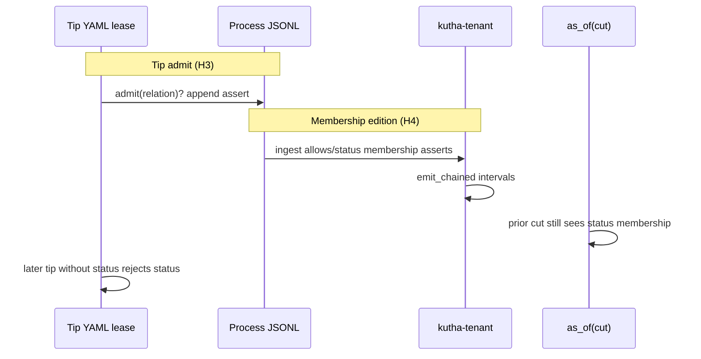

## Goal Capsule

**Objective:** A harness operator can evaluate process rules at a prior process cut the same way norms are evaluated under an overlay — past allowlist/rule state remains recoverable — without shipping a legal corpus.

**Means:** Tip YAML remains the admit lease; process-relation membership editions are logged as asserts and projected AS OF on the H2 tenant (ADR-090 overlay dogfood).

**Product authority:** `.kutha/STATE.md` next thin slice H4; `.kutha/ROADMAP.md` H4 checkbox; `docs/process/kutha-harness.md` H4 rung; ADR-090 overlay rules (not pack ontology). Surrounding product Stages 1–4 / semantic fixture / legal pack are not active scope.

**Stop conditions:** Do not open ADR-050 six kinds, legal pack ontology, Cypher/HNSW, or M002. Do not remove `status` from the repo tip `relations.yaml` to prove AE1.

**Execution profile:** Characterization-first on H2/H3 paths; prove AE1 with fixtures and temp tip YAML before flipping governor disposition or STATE phase.

**Who finishes:** Implementer via `ce-work` (or human) lands U1–U5; lease docs last.

**Open blockers:** None.

**Product Contract preservation:** Product Contract unchanged (R1–R6, AE1–AE3, Key Decisions preserved). Outstanding “Deferred to Planning” items resolved into KTDs below.

## Product Contract

### Summary

H4 is a harness rung: process dictionaries become temporally versioned and queryable AS OF a process cut, using ADR-090 overlay discipline on the existing H2/H3 dogfood stack. It is not a legal pack, not ADR-050 six product dictionaries, and not a reorder of product delivery.

### Problem Frame

H3 admits process events only through a live YAML relation allowlist. Edits to that rule surface have no first-class history on the process tenant, so the plane cannot yet dogfood “rules AS OF a date” the way ADR-090 requires for norms. ROADMAP H4 names that gap; `I-h4-adr-090-overlay` stays deferred until STATE names H4 done.

### Key Decisions

- **Process overlay, not legal pack.** H4 borrows ADR-090 overlay / temporal-projection rules for *process* dictionaries; it does not open ADR-090 ontology, five clocks, or corpus ingest. `(session-settled: user-directed — chosen over legal pack / Stages 1–4 delivery: STATE lease + architecture POV + H4 brainstorm scope)` Governs R1–R6.
- **MVP surface is the H3 relations allowlist.** First process dictionary to gain AS OF history is the process relation list already fail-closing JSONL writes; other process YAML ledgers may follow only if needed for the same acceptance story. Governs R1, R3.
- **Overlay ≠ rewrite of tip authority.** Historical evaluation uses cut + overlay projection; the current working dictionary remains the tip lease for new admits (ADR-090 D090-6 / TR-03 pattern applied to process). Governs R2, R4.
- **Keep H3 fail-closed at tip.** Unknown process relations still must not append JSONL under the current tip rules. Governs R3.
- **Do not implement ADR-050 six kinds.** H3 stub stays a process twin; six bi-temporal product dictionaries remain frozen. Governs R6.

### Actors

- **Harness operator / agent** — changes process rules and needs an older cut to remain interpretable.
- **`kutha-gov` CI quantum** — admits process observations and must stay fail-closed at tip.
- **Process tenant (H2)** — holds process facts; AS OF queries use the emitted cut.

### Requirements

**Temporal process rules**

- R1. After a process-rule change is admitted, an AS OF query at a prior process cut returns the relation allowlist (or equivalent rule projection) that governed admits at that cut — not only the tip YAML.
- R2. Historical rule evaluation is a projection/overlay over admitted process history; it does not silently rewrite or delete tip dictionary files as SoT.
- R3. At the current tip, unknown process relations continue to be rejected (H3 behavior preserved).

**Plane and lifecycle honesty**

- R4. Process-plane dictionaries and product-plane dictionaries remain distinct schemas; mixing them remains a HIGH finding.
- R5. Completing H4 updates delivery lease signals (STATE phase / ROADMAP H4 / `I-h4-adr-090-overlay` disposition) without promoting ADR-090 L_map to Accepted or claiming a legal pack shipped.
- R6. H4 does not introduce ADR-050’s six product dictionary kinds, Cypher/HNSW, M002 Rocks, or a legal/science corpus.

### Key Flows

1. **Tip admit (unchanged intent):** process observation → tip relation allowlist check → append JSONL or reject → optional tenant emit AS OF emitted cut.
2. **Rule change:** operator admits a process-rule change event → tip lease reflects new rules for subsequent admits → prior cuts remain queryable for the old projection.
3. **Historical check:** given cut C before a rule change, AS OF C answers whether relation R would have been allowed under rules at C.

### Acceptance Examples

- AE1. Given tip allows `status` and a later change removes it, AS OF a cut before the change still treats `status` as allowed; tip admits after the change reject `status`. Covers R1–R3.
- AE2. Completing the rung leaves honeycomb ADR-090 `map: Proposed` and does not add legal corpus fixtures. Covers R5–R6.
- AE3. A product-plane relation dictionary path is not used to admit harness JSONL. Covers R4.

### Success Criteria

- ROADMAP H4 can be checked with evidence that process rules AS OF a prior cut differ from tip after a deliberate rule change.
- `kutha-gov ci` remains green with H3 fail-closed tip behavior.
- No new freeze breach (ADR-050 six kinds, legal pack, M002, Cypher/HNSW).

### Scope Boundaries

**In scope**

- Process-plane overlay dogfood for dictionary versioning AS OF, starting at the H3 relations surface.
- Lease/ledger updates that mark H4 when acceptance holds.

**Deferred for later**

- Versioning every process YAML ledger (`fsm`, `checks`, `invariants`, …) if R1 is already satisfied by the relations surface alone.
- Product MetaPrompt / six dictionaries (ADR-050).
- Legal pack stages S0–S6, practice corpus, five-clock mapping.

**Outside this work’s identity**

- Semantic recovery / P→Q fixture as a delivery slice ahead of H4.
- M002 Rocks, Cypher/GPML, HNSW, ADR-080/081, ADR-093 pack.

### Dependencies / Assumptions

- H2 tenant AS OF emitted cut and H3 process allowlist already exist and stay prerequisites.
- ADR-090 overlay/TR semantics are the normative pattern; full ADR-090 ontology stays frozen (`honeycomb.yaml` delivery frozen).
- Assumption: “version process rules the same way as norms” for H4 means AS OF-recoverable process dictionary projections, not git history alone.

### Outstanding Questions

**Resolve Before Planning:** none.

**Deferred to Implementation**

- Exact delimiter/encoding for the membership snapshot object (planning default: sorted comma-joined names).
- Exact product relation token spelling (recommend `processAllows`; must pass FF6 + plane-mix needles).
- Whether CI must emit a live membership edition each quantum, or fixture-only proof is enough for H4 lease (prefer fixture + optional emit helper; do not require editing tip mid-CI).

### Sources / Research

- `.kutha/STATE.md` — Phase H3; next H4 overlay, not legal pack.
- `.kutha/ROADMAP.md` — H4 checkbox wording.
- `docs/process/kutha-harness.md` — H0–H4 ladder; H4 = ADR-090 overlay + H2.
- `docs/ADR/ADR-090-legal-reference-pack.md` — overlay / TR / L_AGENT; not corpus mandate for this slice.
- `docs/ADR/ADR-050-meta-prompt-dictionaries.md` — H3 process twin ≠ six kinds.
- `.kutha/dictionaries/invariants.yaml` — `I-h4-adr-090-overlay`.
- `.compound-engineering/artifacts/handoffs/h4-after-architecture-pov.md` — POV: reject Stages 1–4 as delivery order.
- Grounding dossier (machine-local scratch): `/tmp/compound-engineering-0/ce-brainstorm/h4-overlay/grounding.md`

## Planning Contract

### Key Technical Decisions

- KTD1. **Tip YAML + logged membership editions — not fold-derived tip.** Live `admit()` keeps reading tip YAML; history is assert-only membership rows projected on the tenant. `(chosen over fold-derived tip: bootstrap circularity, `harness-relations` needles YAML, R2)` Governs R2–R3. Units: U1–U3.
- KTD2. **Reserved process relation `allows` stays on tip forever.** Membership logging uses `relation=allows`; AE1 must not remove it from tip. Governs R1, R3. Units: U1, U3.
- KTD3. **One snapshot fact per membership edition — not N open-ended per-member chains.** Each edition is one assert whose object encodes the full allowed set at that edition’s `valid_from`; tenant `emit_chained` closes the prior edition interval when the next edition arrives (same chaining as status/cargo). Do not emit one open chain per member name: omitting a member in a later edition would leave the old fact live under `as_of` (breaks AE1). Process fold/tenant still drop non-assert; no process `Retract`. Governs R1–R2. Units: U1–U2.
- KTD4. **Map only membership + existing H2 pairs through tenant.** Add one product FF6 name for membership objects; do not ingest `high`/`checks`/`tenant`. Governs R4, R6. Units: U2.
- KTD5. **AE1 uses temp tip / `KUTHA_HARNESS_RELATIONS_PATH` — never strip `status` from repo tip.** Removing tip `status` bricks `emit_log`. Governs R3, AE1. Units: U3.

### High-Level Technical Design

Tip YAML is the admit kernel. Membership JSONL + tenant projection is the overlay. They must not be the same SoT.

### Assumptions

- H4 MVP needs only the relations surface (Product Contract MVP decision); other process YAML ledgers stay deferred.
- One new product FF6 relation for membership is H2-class dogfood, not ADR-050 six kinds (document in CHANGELOG Process).
- Fixture-proven AE1 is sufficient evidence to flip `I-h4` and STATE; continuous mid-CI tip edits are out of scope.

### System-Wide Impact

- Harness operators gain AS OF rule history; CI quantum gains one required crate test name.
- Product runtime gains one allowlisted relation and tenant mapping — keep plane-mix checks honest.
- No L_map promotion for ADR-090.

### Implementation Units overview

| Unit | Delivers | Depends on |
|------|----------|------------|
| U1 | Process membership encoding + tip `allows` | — |
| U2 | Tenant mapping + Rust AS OF test | U1 |
| U3 | Pytest tip-reject half of AE1 | U1 |
| U4 | Governor + FSM required wiring | U2, U3 |
| U5 | Lease docs (STATE/ROADMAP/CHANGELOG) | U4 |

## Implementation Units

### U1. Process membership edition encoding

**Goal:** Admit assert-only membership editions for the process relations surface without changing tip admit semantics.

**Requirements:** R1, R2, R3 (encoding side)

**Dependencies:** none

**Files:**
- Modify: `.kutha/dictionaries/relations.yaml` (append `allows`)
- Modify: `scripts/kutha_gov/time_log.py` (helper to append membership edition asserts)
- Modify: `scripts/kutha_gov/process_allow.py` only if comments/docs need clarifying reserved `allows`
- Modify: `docs/process/kutha-harness.md` (H4 mapping row for membership)
- Test: `scripts/tests/test_kutha_gov.py`

**Approach:**
1. Keep `admit()` on tip YAML; add `allows` to tip so membership editions can be written.
2. Add a helper that, given a frozenset of member relation names, appends **one** assert: stable subject (e.g. `process.relations`), `relation=allows`, `object=<deterministic encoding of the full set>` (planning default: sorted comma-joined names; implementer may pick an equally decodeable encoding).
3. Do not derive tip from fold; do not emit `op=retract`; do not emit one assert per member (see KTD3).

**Patterns to follow:** `append_run` / `append_observe` fail-closed via `admit`; lean `HarnessEvent` shape in `time_log.py`.

**Test scenarios:**
- Allowed membership edition with `allows` on tip appends exactly one assert whose object decodes to the full set.
- Membership relation itself rejected when tip omits `allows` (temp YAML).
- Existing unknown observation relation still rejected (H3 regression).

**Execution note:** Characterization-first — extend existing allowlist pytest patterns before tenant work.

### U2. Tenant AS OF projection for membership

**Goal:** Historical membership is queryable via H2 `as_of` on the process tenant.

**Requirements:** R1, R2, R4, R6; Covers AE1 (historical half)

**Dependencies:** U1

**Files:**
- Modify: `crates/kutha-runtime/src/tenant.rs`
- Modify: `crates/kutha-runtime/dictionaries/relations.yaml` (one new name)
- Modify: `crates/kutha-runtime/tests/` (new `h4_*` or extend `h2_harness_tenant.rs`)
- Create/modify: fixture JSONL under `crates/kutha-runtime/tests/fixtures/`
- Modify: `.kutha/dictionaries/checks.yaml` `relation-allowlist` needles if required by existing check text
- Optional: `crates/kutha-runtime/src/bin/kutha-tenant.rs` only if CI stdout needs a second as_of line (prefer crate test without changing tenant parse)

**Approach:**
1. Collect membership **edition** asserts during ingest (one object = full set encoding from U1).
2. Emit them as a **single** chained stream under one new product relation (recommend `processAllows`) — same `emit_chained` shape as `runStatus`, not parallel per-member chains.
3. Fixture: edition A object includes `status`; edition B object omits it; `as_of(cut_A)` decodes a set containing `status`; `as_of(cut_B)` does not (prior edition closed by chaining).
4. Do not map `high`/`checks`/`tenant`.

**Patterns to follow:** `emit_chained` on successive scalar objects (`runStatus` / `observed`); `h2_same_second_status_as_of_uses_emitted_cut`; FF6 unknown-relation tests. Do **not** treat membership as N independent status/cargo-like streams keyed by member name.

**Test scenarios:**
- Covers AE1. Prior-cut `as_of` still decodes a set containing `status` after a later edition object omits it.
- Same-second membership + status uses emitted cut, not raw `valid_from`.
- Unmapped harness relations still do not grow the product log.
- Unknown product relation name still fail-closes FF6.

### U3. Tip-reject half of AE1 (pytest)

**Goal:** Prove tip without `status` rejects `status` admits without bricking repo tip.

**Requirements:** R3; Covers AE1 (tip half)

**Dependencies:** U1

**Files:**
- Modify: `scripts/tests/test_kutha_gov.py`
- Optional helper docs in `docs/process/kutha-harness.md`

**Approach:**
1. Temp root / `KUTHA_HARNESS_RELATIONS_PATH` with tip that includes `allows` but omits `status`.
2. Assert `append_run` / observation path rejects `status` and does not append it.
3. Keep repo `.kutha/dictionaries/relations.yaml` including `status`.

**Patterns to follow:** `test_unknown_process_relation_does_not_append`.

**Test scenarios:**
- Covers AE1. Tip without `status` rejects `status`; allowed relations still write.
- Repo tip fixture used by other tests still includes `status` (no accidental global strip).

### U4. Governor and FSM evidence wiring

**Goal:** Flip `I-h4-adr-090-overlay` from deferred to check-backed evidence without promoting ADR-090 L_map.

**Requirements:** R5, R6; Covers AE2

**Dependencies:** U2, U3

**Files:**
- Modify: `.kutha/dictionaries/invariants.yaml`
- Modify: `.kutha/dictionaries/checks.yaml`
- Modify: `.kutha/dictionaries/bridges.yaml` (if citing the crate test)
- Modify: `.kutha/dictionaries/fsm.yaml` (`observe_cargo.required` append H4 test fn)
- Modify: `docs/process/governor-intake.md` only if a new intake note is needed (prefer YAML-only)

**Approach:**
1. Add named evidence: crate test fn for AE1 historical half; pytest covers tip half.
2. Bridge cites product/crate test; control-loop check covers STATE/ROADMAP needles when lease flips (U5) — do not put the same check id on both ledgers.
3. Append FSM `required` list with the new Rust test name.
4. Keep honeycomb ADR-090 `map: Proposed`, `delivery: frozen`.

**Patterns to follow:** `B-relation-allowlist` / `B-observe-required-fn`; `invariants-ledger` deferred→check flip recipe.

**Test scenarios:**
- `uv run kutha-gov precommit` accepts the new ledger rows.
- `observe-required-fn` fails if the H4 test name is removed from `required` while the check expects it (or inverse characterization).

**Test expectation:** ledger/FSM wiring validated by governor precommit + existing observe-required-fn; no new product behavior beyond U2/U3.

### U5. Delivery lease promotion

**Goal:** Name H4 done in process leases after evidence exists.

**Requirements:** R5; Covers AE2

**Dependencies:** U4

**Files:**
- Modify: `.kutha/STATE.md`
- Modify: `.kutha/ROADMAP.md`
- Modify: `docs/process/kutha-harness.md` (H4 row “Now” / dogfood note)
- Modify: `CHANGELOG.md` (Process + Trajectory)
- Modify: `AGENTS.md` / `README.md` lease one-liners if they still say “next H4”

**Approach:**
1. Phase → H4 (or “H4 done; next …” per STATE convention once chosen).
2. Check ROADMAP H4 box.
3. CHANGELOG states process overlay dogfood, not legal pack; ADR-090 remains Proposed.
4. Do not unfreeze full ADR-090 ontology in honeycomb.

**Test expectation:** none — docs/lease; verified by governor needles from U4 + human review of AE2.

## Verification Contract

**Commands:**
- `uv run pytest`
- `cargo test --workspace` (includes new H4/H2 tenant test)
- `uv run kutha-gov precommit`
- `uv run kutha-gov ci` (after FSM required name lands)

**Quality gates:**
- AE1 both halves green (pytest tip + Rust as_of).
- Plane-mix / relation-allowlist governor checks green.
- No legal corpus fixtures; ADR-090 stays Proposed.

## Definition of Done

**Global:**
- R1–R6 satisfied with AE1–AE3 evidence.
- STATE/ROADMAP/CHANGELOG reflect H4 without claiming legal pack or Accepted ADR-090.
- Freeze list intact (no six kinds, Cypher, M002, ontology unfreeze).

**Per unit:**
- U1: membership helper + tip `allows` + pytest green.
- U2: tenant mapping + Rust AE1 historical test green.
- U3: tip-reject pytest green without editing repo tip `status`.
- U4: `I-h4` check-backed; FSM required lists H4 test; precommit green.
- U5: lease docs updated; Trajectory honest.
